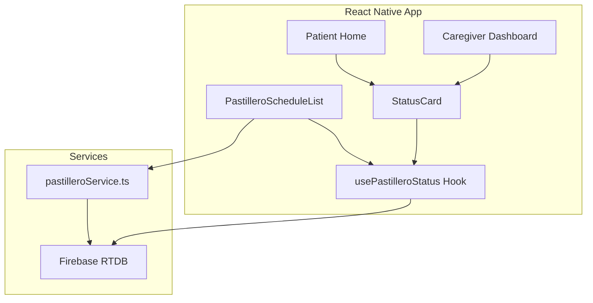

# Design Document

## Overview

Este diseño implementa un sistema de demostración para el pastillero con horarios fijos. La solución incluye una estructura de datos TypeScript, un servicio para sincronizar con Firebase RTDB, componentes React Native para visualización, y un hook personalizado para escuchar cambios en tiempo real.

## Architecture



## Components and Interfaces

### 1. Data Types (`src/types/pastillero.ts`)

```typescript
/** Turno del día para dispensar medicación */
export type TurnoType = 0 | 1 | 2 | 3; // 0=mañana, 1=mediodía, 2=tarde, 3=noche

/** Día de la semana (0=domingo, 6=sábado) */
export type DiaType = 0 | 1 | 2 | 3 | 4 | 5 | 6;

/** Entrada de horario del pastillero para visualización */
export interface DemoScheduleEntry {
  dia: DiaType;
  turno: TurnoType;
  hora: string;       // Formato HH:mm
  diaName: string;    // Nombre del día en español
  turnoName: string;  // Nombre del turno en español
}

/** Estado del pastillero desde RTDB */
export interface PastilleroStatus {
  ultimoDispense: number | null; // Unix timestamp
  online: boolean;
}

/** Props para StatusCard */
export interface StatusCardProps {
  online: boolean;
  ultimoDispense: number | null;
  horarios: DemoScheduleEntry[];
}

/** Comandos de RTDB para el dispositivo */
export interface PastilleroCommands {
  domingoManana: boolean;
  domingoMediodia: boolean;
  domingoTarde: boolean;
  domingoNoche: boolean;
  lunesManana: boolean;
  lunesMediodia: boolean;
  lunesTarde: boolean;
  lunesNoche: boolean;
  martesManana: boolean;
  martesMediodia: boolean;
  martesTarde: boolean;
  martesNoche: boolean;
  miercolesManana: boolean;
  miercolesMediodia: boolean;
  miercolesTarde: boolean;
  miercolesNoche: boolean;
  juevesManana: boolean;
  juevesMediodia: boolean;
  juevesTarde: boolean;
  juevesNoche: boolean;
  viernesManana: boolean;
  viernesMediodia: boolean;
  viernesTarde: boolean;
  viernesNoche: boolean;
  sabadoManana: boolean;
  sabadoMediodia: boolean;
  sabadoTarde: boolean;
  sabadoNoche: boolean;
  topo?: boolean;
  led?: boolean;
}
```

### 2. Service (`src/services/pastilleroService.ts`)

```typescript
import { ref, update } from 'firebase/database';
import { deviceRdb } from './firebase';

/** Nombres de días en español para las keys de RTDB */
const DIAS = ['domingo', 'lunes', 'martes', 'miercoles', 'jueves', 'viernes', 'sabado'] as const;

/** Nombres de turnos para las keys de RTDB */
const TURNOS = ['Manana', 'Mediodia', 'Tarde', 'Noche'] as const;

/** Horarios fijos por turno */
export const HORARIOS_TURNO: Record<number, string> = {
  0: '08:00', // Mañana
  1: '12:30', // Mediodía
  2: '17:00', // Tarde
  3: '21:00', // Noche
};

/** Estructura de horario de demo */
export interface DemoScheduleEntry {
  dia: number;      // 0-6 (domingo-sábado)
  turno: number;    // 0-3 (mañana-noche)
  hora: string;     // HH:mm
  diaName: string;  // Nombre del día
  turnoName: string; // Nombre del turno
}

/** Constante con horarios de demo */
export const DEMO_PASTILLERO_SCHEDULE: DemoScheduleEntry[] = [
  { dia: 1, turno: 0, hora: '08:00', diaName: 'Lunes', turnoName: 'Mañana' },
  { dia: 2, turno: 1, hora: '12:30', diaName: 'Martes', turnoName: 'Mediodía' },
  { dia: 3, turno: 2, hora: '17:00', diaName: 'Miércoles', turnoName: 'Tarde' },
  { dia: 4, turno: 3, hora: '21:00', diaName: 'Jueves', turnoName: 'Noche' },
  { dia: 5, turno: 0, hora: '08:00', diaName: 'Viernes', turnoName: 'Mañana' },
  { dia: 6, turno: 1, hora: '12:30', diaName: 'Sábado', turnoName: 'Mediodía' },
  { dia: 0, turno: 2, hora: '17:00', diaName: 'Domingo', turnoName: 'Tarde' },
];

/** Genera el objeto de comandos para RTDB */
export function generateRtdbCommands(schedule: DemoScheduleEntry[]): Record<string, boolean> {
  // Inicializar todos los turnos en false
  const commands: Record<string, boolean> = {};
  DIAS.forEach(dia => {
    TURNOS.forEach(turno => {
      commands[`${dia}${turno}`] = false;
    });
  });
  
  // Activar solo los turnos del schedule
  schedule.forEach(entry => {
    const diaKey = DIAS[entry.dia];
    const turnoKey = TURNOS[entry.turno];
    commands[`${diaKey}${turnoKey}`] = true;
  });
  
  return commands;
}

/** Sube los horarios del pastillero a Firebase RTDB */
export async function uploadPastilleroData(
  deviceId: string,
  schedule: DemoScheduleEntry[] = DEMO_PASTILLERO_SCHEDULE
): Promise<void> {
  const commands = generateRtdbCommands(schedule);
  const commandsRef = ref(deviceRdb, `/devices/${deviceId}/commands`);
  await update(commandsRef, commands);
}
```

### 3. Hook (`src/hooks/usePastilleroStatus.ts`)

```typescript
import { useEffect, useState } from 'react';
import { ref, onValue } from 'firebase/database';
import { deviceRdb } from '../services/firebase';

interface UsePastilleroStatusResult {
  ultimoDispense: number | null;
  online: boolean;
  loading: boolean;
  commands: Record<string, boolean> | null;
}

interface UsePastilleroStatusOptions {
  deviceId: string;
  enabled?: boolean;
}

export function usePastilleroStatus({
  deviceId,
  enabled = true,
}: UsePastilleroStatusOptions): UsePastilleroStatusResult {
  const [ultimoDispense, setUltimoDispense] = useState<number | null>(null);
  const [online, setOnline] = useState(false);
  const [commands, setCommands] = useState<Record<string, boolean> | null>(null);
  const [loading, setLoading] = useState(true);

  useEffect(() => {
    if (!deviceId || !enabled) {
      setLoading(false);
      return;
    }

    // Listener para estado del dispositivo
    const stateRef = ref(deviceRdb, `/devices/${deviceId}/state`);
    const commandsRef = ref(deviceRdb, `/devices/${deviceId}/commands`);
    
    const unsubState = onValue(
      stateRef,
      (snapshot) => {
        const data = snapshot.val();
        setOnline(data?.is_online ?? false);
        setUltimoDispense(data?.last_event_at ?? null);
        setLoading(false);
      },
      (error) => {
        console.error('[usePastilleroStatus] State error:', error);
        setLoading(false);
      }
    );

    const unsubCommands = onValue(
      commandsRef,
      (snapshot) => {
        const data = snapshot.val();
        setCommands(data ?? null);
      },
      (error) => {
        console.error('[usePastilleroStatus] Commands error:', error);
      }
    );

    return () => {
      unsubState();
      unsubCommands();
    };
  }, [deviceId, enabled]);

  return { ultimoDispense, online, loading, commands };
}
```

### 4. Components

#### PastilleroScheduleList (`src/components/shared/PastilleroScheduleList.tsx`)

- Usa FlatList para renderizar los 7 días
- Cada item es un Card con día, turno y hora
- Colores por turno usando design tokens
- Botón para subir datos a RTDB

#### StatusCard (`src/components/shared/StatusCard.tsx`)

- Indicador circular verde/rojo para estado online
- Texto relativo para último dispense (usando `formatDistanceToNow` de date-fns)
- Cálculo del próximo horario del día actual
- Iconos de Ionicons

## Data Models

### Firebase RTDB Structure (Existing)

La estructura existente en RTDB usa variables booleanas para cada combinación día+turno:

```
/devices/{deviceId}/commands
├── domingoManana: false
├── domingoMediodia: false
├── domingoTarde: false
├── domingoNoche: false
├── lunesManana: false      // true = alarma activa para Lunes mañana
├── lunesMediodia: false
├── lunesTarde: false
├── lunesNoche: false
├── martesManana: false
├── martesMediodia: false
├── martesTarde: false
├── martesNoche: false
├── miercolesManana: false
├── miercolesMediodia: false
├── miercolesTarde: false
├── miercolesNoche: false
├── juevesManana: false
├── juevesMediodia: false
├── juevesTarde: false
├── juevesNoche: false
├── viernesManana: false
├── viernesMediodia: false
├── viernesTarde: false
├── viernesNoche: false
├── sabadoManana: false
├── sabadoMediodia: false
├── sabadoTarde: false
├── sabadoNoche: false
├── topo: false              // Alarma topo activa
├── turnotest: 11.18         // Hora de prueba
└── led: false               // Estado LED
```

### Horarios Fijos por Turno

| Turno     | Índice | Hora Default |
|-----------|--------|--------------|
| Mañana    | 0      | 08:00        |
| Mediodía  | 1      | 12:30        |
| Tarde     | 2      | 17:00        |
| Noche     | 3      | 21:00        |

### Estructura de Demo a Subir

Para el demo, activaremos las siguientes combinaciones:

```
lunesManana: true      → Lunes 08:00
martesMediodia: true   → Martes 12:30
miercolesTarde: true   → Miércoles 17:00
juevesNoche: true      → Jueves 21:00
viernesManana: true    → Viernes 08:00
sabadoMediodia: true   → Sábado 12:30
domingoTarde: true     → Domingo 17:00
```

### Color Mapping

| Turno | Nombre   | Color Token          | Hex Value |
|-------|----------|---------------------|-----------|
| 0     | Mañana   | `colors.warning`    | #F59E0B   |
| 1     | Mediodía | `colors.orange`     | #F97316   |
| 2     | Tarde    | `colors.primary`    | #3B82F6   |
| 3     | Noche    | `colors.purple`     | #8B5CF6   |

## Error Handling

1. **RTDB Connection Failure**
   - Hook retorna `loading: false`, valores null
   - UI muestra estado "desconectado"

2. **Upload Failure**
   - Función lanza error con mensaje descriptivo
   - Componente muestra Alert con error

3. **Missing Data**
   - StatusCard muestra "Sin datos" si no hay horarios
   - Valores por defecto para campos opcionales

## Testing Strategy

### Unit Tests
- Validar estructura de `DEMO_PASTILLERO_DATA`
- Probar cálculo de próximo horario
- Probar formato de tiempo relativo

### Integration Tests
- Verificar escritura a RTDB mock
- Verificar listener de cambios

### Component Tests
- Renderizado correcto de colores por turno
- Estado online/offline visual
- Accesibilidad de elementos
