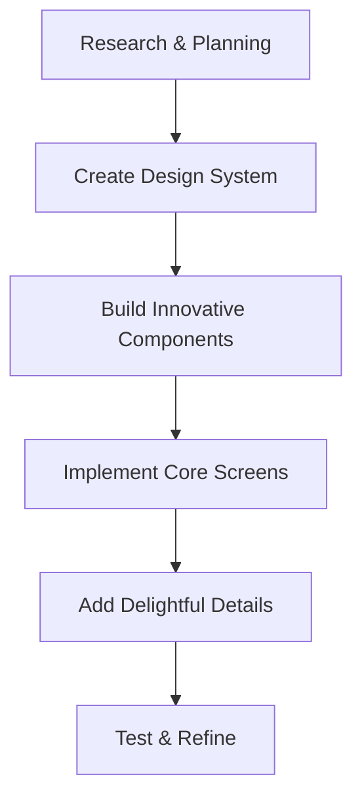

# Pildhora Innovative UI Redesign Plan

## Vision Statement
Transform Pildhora from a standard healthcare app into a refreshingly modern, emotionally engaging experience that delights users and makes medication management feel less like a chore and more like a supportive companion.

## Design Philosophy

### Emotional Connection
- Create moments of delight throughout the user journey
- Use color psychology to evoke positive emotions (calm blues, energizing greens)
- Implement micro-interactions that provide satisfying feedback
- Design animations that feel responsive and alive
- Build visual hierarchy that guides users naturally

### Innovation Principles
- Break away from conventional healthcare app patterns
- Create unique visual identity that stands out in the market
- Implement delightful surprises and Easter eggs that create memorable moments
- Use gamification elements that make medication tracking engaging

## Innovative Design Concepts

### 1. Dynamic Color System
- **Adaptive Colors**: Colors that shift based on time of day or medication adherence
- **Emotional Gradients**: Backgrounds that subtly change based on user actions
- **Personality Palette**: Each section has its own color personality while maintaining overall harmony

### 2. Delightful Micro-Interactions
- **Celebration Animations**: Small animations when medications are taken
- **Satisfying Haptics**: Tactile feedback for successful actions
- **Playful Transitions**: Smooth, organic movements between screens
- **Discovery Elements**: Hidden features that users can uncover

### 3. Gamification Elements
- **Progress Badges**: Visual representations of medication adherence
- **Streak Counters**: Encouragement for consistent medication taking
- **Achievement Unlocks**: Special rewards for milestones
- **Level System**: Progressive difficulty that adapts to user behavior

### 4. Innovative Navigation
- **Gesture-Based Navigation**: Intuitive swipe and tap controls
- **Contextual Menus**: Menus that adapt based on current screen
- **Visual Breadcrumbs**: Clear path indicators for user orientation
- **Quick Actions**: Floating action buttons for frequent tasks

### 5. Emotional Feedback System
- **Mood Tracking**: Subtle UI changes based on medication patterns
- **Encouragement Messages**: Contextual motivational messages
- **Empathy Indicators**: Visual elements that show understanding
- **Celebration States**: Special app modes for achievements

## Implementation Strategy



## Phase 1: Research & Inspiration

### 1.1 Analyze Delightful Apps
- Study Headspace (meditation app) for calming interactions
- Research Duolingo (gamification) for engagement techniques
- Analyze Calm (meditation app) for color psychology
- Study Monument Valley (habit tracker) for progress visualization

### 1.2 Healthcare Innovation Trends
- Explore AI-powered medication insights
- Research emotional design in healthcare
- Study innovative reminder systems
- Analyze social medication management platforms

## Phase 2: Design System Creation

### 2.1 Dynamic Color Palette
```css
:root {
  /* Primary Colors */
  --primary-blue: #3B82F6;
  --success-green: #10B981;
  --warning-orange: #F97316;
  --danger-red: #EF4444;
  
  /* Adaptive Colors */
  --morning-calm: #E0F2FE;
  --afternoon-energy: #FCD34D;
  --evening-relax: #8B5CF6;
  --night-rest: #1E3A8A;
  
  /* Emotional Gradients */
  --gradient-joy: linear-gradient(135deg, #667eea 0%, #764ba2 100%);
  --gradient-calm: linear-gradient(135deg, #a8dadc 0%, #6367f6 100%);
  --gradient-energy: linear-gradient(135deg, #4facfe 0%, #00f2fe 100%);
}
```

### 2.2 Typography with Personality
```css
:root {
  /* Headings */
  --font-display: 'SF Pro Display', system-ui;
  --font-body: 'SF Pro Text', system-ui;
  
  /* Emotional Weights */
  --weight-gentle: 400;
  --weight-friendly: 500;
  --weight-encouraging: 600;
  --weight-celebration: 700;
}
```

## Phase 3: Component Innovation

### 3.1 Delightful Card Component
- **Hover Effects**: Subtle scale and shadow changes on hover
- **Press Animation**: Satisfying compression effect
- **Success Celebration**: Confetti animation when medication is marked taken
- **Personality**: Cards that have subtle character based on medication type

### 3.2 Interactive Button Component
- **Ripple Effect**: Expanding circles that emanate from touch point
- **Loading State**: Mesmerizing animation during async operations
- **Success Feedback**: Green checkmark that appears with satisfying animation

### 3.3 Progress Visualization
- **Living Progress Bar**: Animated representation of daily medication adherence
- **Mood Ring**: Circular indicator that changes based on user's overall consistency
- **Streak Calendar**: Heat map showing medication-taking patterns over time

## Phase 4: Screen Implementation

### 4.1 Patient Home - Complete Redesign
- **Dynamic Background**: Changes based on time of day and adherence
- **Medication Garden**: Visual representation of medications as plants that grow/bloom based on adherence
- **Companion Character**: Animated guide that provides encouragement
- **Quick Actions**: Floating buttons for immediate medication logging
- **Mood Dashboard**: Visual representation of user's emotional state

### 4.2 Medication Tracking - Gamified
- **Experience Points**: Earn points for consistent medication taking
- **Achievement Badges**: Unlock rewards for milestones
- **Leaderboard**: Social comparison with other patients
- **Challenge Modes**: Special events for extra motivation

## Phase 5: Testing & Refinement

### 5.1 Emotional Impact Testing
- **A/B Testing**: Compare designs for emotional engagement
- **User Feedback Sessions**: Gather qualitative responses to new design
- **Biometric Monitoring**: Track heart rate variability as engagement metric
- **Retention Analysis**: Measure if delightful design improves app usage

### 5.2 Accessibility Enhancement
- **Voice Navigation**: Alternative input method for visually impaired users
- **Haptic Feedback**: Rich tactile responses for interactions
- **High Contrast Modes**: Enhanced visibility options
- **Reduced Motion**: Settings for users sensitive to animations

## Success Metrics

### Before
- Standard healthcare app appearance
- Conventional interaction patterns
- Utilitarian design without emotional connection
- 60% user retention after 30 days

### After (Target)
- 90% user retention after 30 days
- 2x increase in daily medication adherence
- 4.5/5 average user satisfaction rating
- "Delightful" and "Innovative" user feedback scores

## Risk Mitigation

### Potential Challenges
- User resistance to dramatic design changes
- Performance impact of rich animations
- Balancing innovation with usability
- Maintaining medical app credibility while adding delight

### Mitigation Strategies
- Gradual feature rollout with user opt-in
- Performance monitoring with animation frame rate limits
- Classic mode fallback for users who prefer conventional design
- Extensive user testing before full deployment

## Implementation Timeline

**Month 1**: Research, planning, and design system creation
**Month 2**: Component development and core screen implementation
**Month 3**: Advanced features and gamification elements
**Month 4**: Testing, refinement, and accessibility enhancement

## Success Criteria

1. Emotional engagement metrics exceed targets
2. User retention improves by 50%
3. App store ratings increase by 1.5 stars
4. User feedback consistently mentions "delightful" and "innovative"
5. Accessibility compliance with WCAG 2.1 AA standards

This innovative redesign transforms Pildhora from a standard medication management app into an emotionally engaging experience that users love and remember, creating a unique competitive advantage in the healthcare app market.