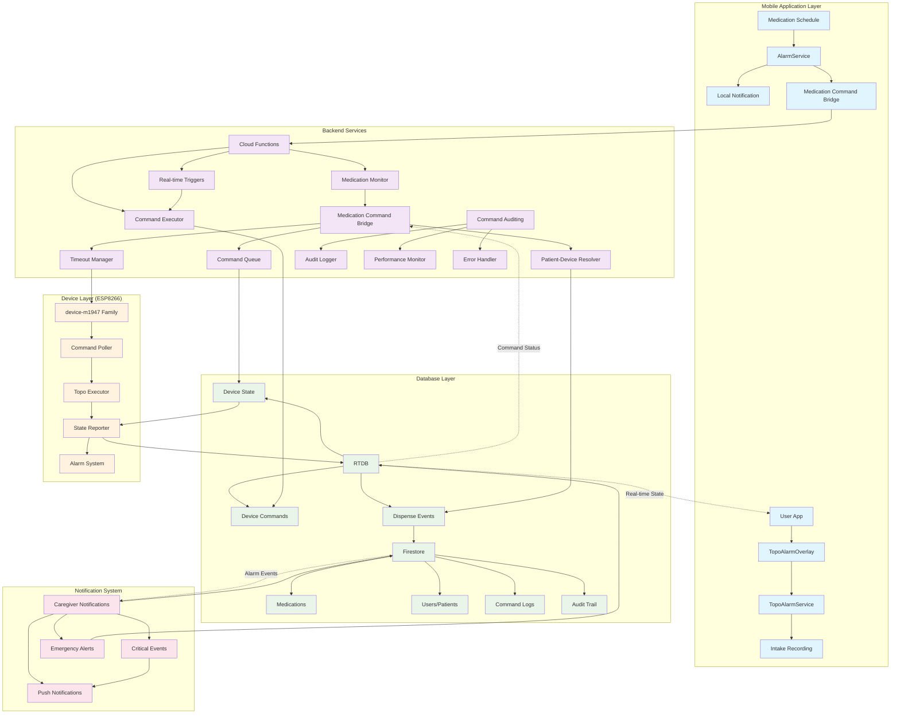
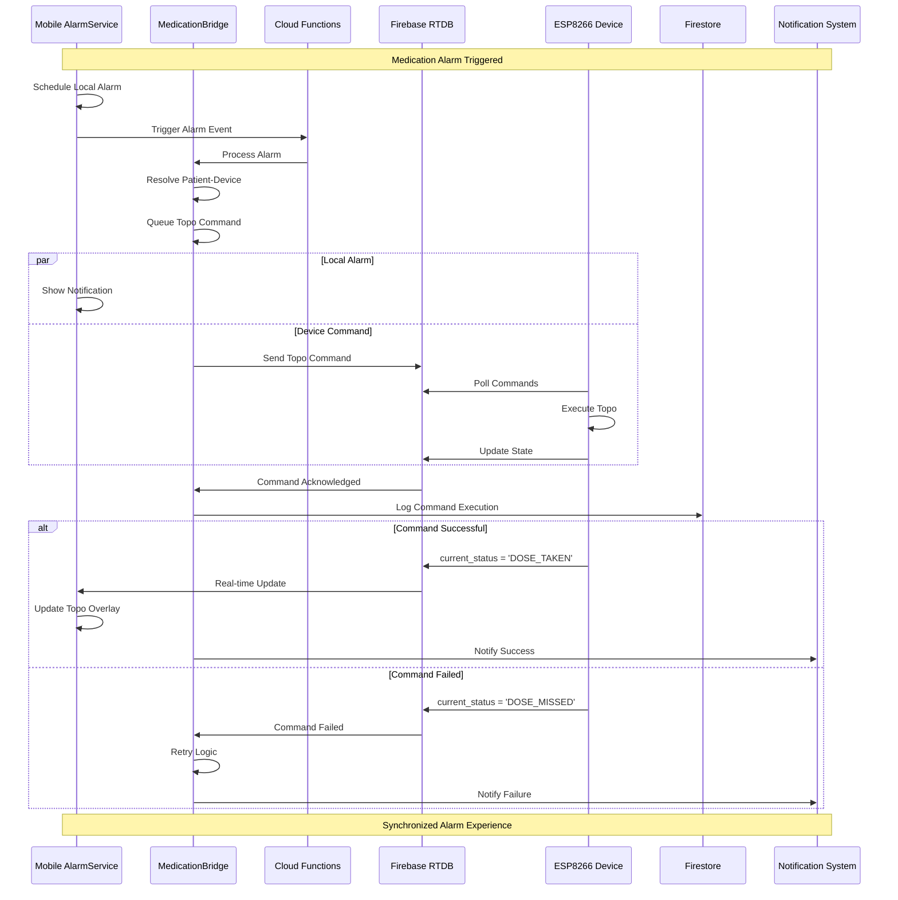

# System Architecture Diagram

## Medication Alarm to Device Command Integration Flow



## Command Execution Flow



## Database Schema Overview

```mermaid
erDiagram
    MEDICATIONS ||--o{ MEDICATION_ALARMS : triggers
    MEDICATIONS ||--o{ MEDICATION_COMMANDS : generates
    USERS ||--o{ MEDICATIONS : owns
    USERS ||--o{ DEVICES : controls
    DEVICES ||--o{ MEDICATION_COMMANDS : receives
    DEVICES ||--o{ DEVICE_COMMANDS : executes
    
    MEDICATIONS {
        string id PK
        string patientId FK
        string name
        string dosage
        array times
        string frequency
        boolean trackInventory
    }
    
    MEDICATION_ALARMS {
        string id PK
        string medicationId FK
        string patientId FK
        timestamp scheduledTime
        timestamp triggeredAt
        string status
        array alarmIds
    }
    
    MEDICATION_COMMANDS {
        string id PK
        string medicationId FK
        string patientId FK
        string deviceId FK
        string commandType
        string status
        timestamp executedAt
        number retryCount
    }
    
    USERS {
        string id PK
        string email
        string role
        string name
        string deviceId
    }
    
    DEVICES {
        string id PK
        string primaryPatientId FK
        string firmwareVersion
        boolean online
        object commandConfig
    }
    
    COMMAND_AUDIT_LOGS {
        string id PK
        string commandId FK
        string medicationId FK
        string patientId FK
        string action
        timestamp timestamp
        object metadata
    }