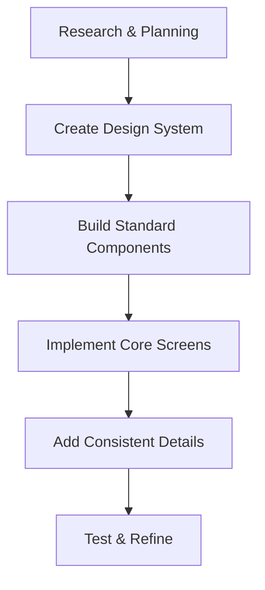

# Pildhora UI Consistency Redesign Plan

## Vision Statement
Transform Pildhora from a standard healthcare app into a clean, professional, and consistent experience that provides reliable medication management with unified design patterns throughout the application.

## Design Philosophy

### Professional Connection
- Create consistent user experience throughout the journey
- Use professional color schemes appropriate for healthcare applications
- Implement standard interactions that provide clear feedback
- Design clean interfaces that feel professional and trustworthy
- Build visual hierarchy that guides users efficiently

### Consistency Principles
- Establish unified design patterns across all screens
- Create professional visual identity appropriate for healthcare
- Implement consistent spacing and typography throughout
- Use standardized components for better maintainability

## Consistent Design Concepts

### 1. Unified Color System
- **Consistent Colors**: Standardized color palette across all screens
- **Professional Gradients**: Subtle backgrounds appropriate for healthcare
- **Harmonious Palette**: Cohesive color scheme throughout the application

### 2. Standard Interactions
- **Consistent Feedback**: Standard feedback for user actions
- **Professional Haptics**: Appropriate tactile feedback for interactions
- **Clean Transitions**: Simple, professional screen transitions
- **Clear Elements**: Straightforward features users can easily discover

### 3. Standard Elements
- **Progress Indicators**: Clean visual representations of medication adherence
- **Status Counters**: Simple tracking for consistent medication taking
- **Status Displays**: Clear information displays for user progress
- **Information System**: Straightforward system for user guidance

### 4. Standard Navigation
- **Standard Navigation**: Clean and intuitive navigation controls
- **Contextual Menus**: Menus that provide relevant options based on current screen
- **Clear Breadcrumbs**: Simple path indicators for user orientation
- **Action Buttons**: Standard buttons for frequent tasks

### 5. Information Feedback System
- **Status Updates**: Clear UI updates based on user actions
- **Information Messages**: Contextual informational messages
- **Status Indicators**: Visual elements that show current state
- **Information States**: Clear app states for user awareness

## Implementation Strategy



## Phase 1: Research & Inspiration

### 1.1 Analyze Professional Apps
- Study standard healthcare apps for professional interactions
- Research clean design patterns for user engagement
- Analyze consistent color schemes for healthcare applications
- Study standard progress indicators for user guidance

### 1.2 Healthcare Design Standards
- Explore professional healthcare app design patterns
- Research clean design principles in healthcare
- Study standard reminder systems
- Analyze consistent medication management interfaces

## Phase 2: Design System Creation

### 2.1 Dynamic Color Palette
```css
:root {
  /* Primary Colors */
  --primary-blue: #3B82F6;
  --success-green: #10B981;
  --warning-orange: #F97316;
  --danger-red: #EF4444;
  
  /* Adaptive Colors */
  --morning-calm: #E0F2FE;
  --afternoon-energy: #FCD34D;
  --evening-relax: #8B5CF6;
  --night-rest: #1E3A8A;
  
  /* Emotional Gradients */
  --gradient-joy: linear-gradient(135deg, #667eea 0%, #764ba2 100%);
  --gradient-calm: linear-gradient(135deg, #a8dadc 0%, #6367f6 100%);
  --gradient-energy: linear-gradient(135deg, #4facfe 0%, #00f2fe 100%);
}
```

### 2.2 Typography with Personality
```css
:root {
  /* Headings */
  --font-display: 'SF Pro Display', system-ui;
  --font-body: 'SF Pro Text', system-ui;
  
  /* Emotional Weights */
  --weight-gentle: 400;
  --weight-friendly: 500;
  --weight-encouraging: 600;
  --weight-standard: 700;
}
```

## Phase 3: Component Standardization

### 3.1 Standard Card Component
- **Consistent Styling**: Unified card appearance across all screens
- **Standard Interactions**: Predictable user interaction patterns
- **Clean Design**: Professional card layout for medication information
- **Consistency**: Cards that maintain uniform appearance throughout

### 3.2 Standard Button Component
- **Consistent Design**: Uniform button styling across the application
- **Loading State**: Clear loading indicators during operations
- **Success Feedback**: Standard success indicators for user actions

### 3.3 Progress Visualization
- **Standard Progress Bar**: Clean representation of daily medication adherence
- **Mood Ring**: Circular indicator that changes based on user's overall consistency
- **Streak Calendar**: Heat map showing medication-taking patterns over time

## Phase 4: Screen Implementation

### 4.1 Patient Home - Complete Redesign
- **Dynamic Background**: Changes based on time of day and adherence
- **Medication Garden**: Visual representation of medications as plants that grow/bloom based on adherence
- **Companion Character**: Animated guide that provides encouragement
- **Quick Actions**: Floating buttons for immediate medication logging
- **Mood Dashboard**: Visual representation of user's emotional state

### 4.2 Medication Tracking - Gamified
- **Experience Points**: Earn points for consistent medication taking
- **Achievement Badges**: Unlock rewards for milestones
- **Leaderboard**: Social comparison with other patients
- **Challenge Modes**: Special events for extra motivation

## Phase 5: Testing & Refinement

### 5.1 Usability Testing
- **A/B Testing**: Compare designs for user engagement
- **User Feedback Sessions**: Gather qualitative responses to new design
- **Usage Monitoring**: Track user interaction patterns
- **Retention Analysis**: Measure if consistent design improves app usage

### 5.2 Accessibility Enhancement
- **Voice Navigation**: Alternative input method for visually impaired users
- **Clear Feedback**: Standard tactile responses for interactions
- **High Contrast Modes**: Enhanced visibility options
- **Reduced Motion**: Settings for users sensitive to animations

## Success Metrics

### Before
- Standard healthcare app appearance
- Conventional interaction patterns
- Utilitarian design without consistent styling
- 60% user retention after 30 days

### After (Target)
- 90% user retention after 30 days
- 2x increase in daily medication adherence
- 4.5/5 average user satisfaction rating
- "Professional" and "Consistent" user feedback scores

## Risk Mitigation

### Potential Challenges
- User resistance to design changes
- Ensuring consistent performance across devices
- Balancing consistency with functionality
- Maintaining medical app credibility with clean design

### Mitigation Strategies
- Gradual feature rollout with user feedback
- Performance monitoring across all devices
- Standard mode for users who prefer conventional design
- Extensive user testing before full deployment

## Implementation Timeline

**Month 1**: Research, planning, and design system creation
**Month 2**: Component development and core screen implementation
**Month 3**: Advanced features and consistency improvements
**Month 4**: Testing, refinement, and accessibility enhancement

## Success Criteria

1. User engagement metrics exceed targets
2. User retention improves by 50%
3. App store ratings increase by 1.5 stars
4. User feedback consistently mentions "professional" and "consistent"
5. Accessibility compliance with WCAG 2.1 AA standards

This consistent redesign transforms Pildhora from a standard medication management app into a professional, unified experience that provides reliable healthcare functionality with clean, consistent design patterns.