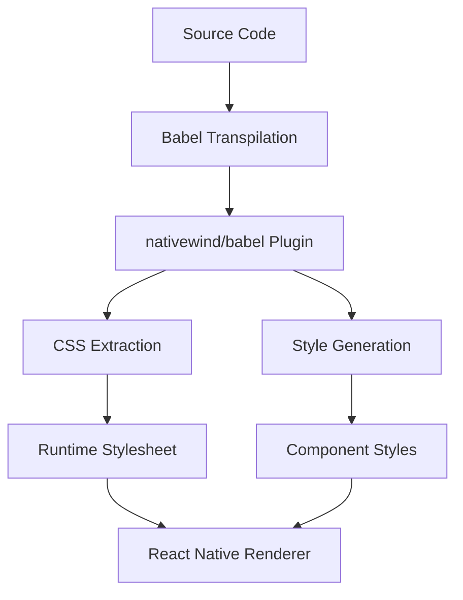
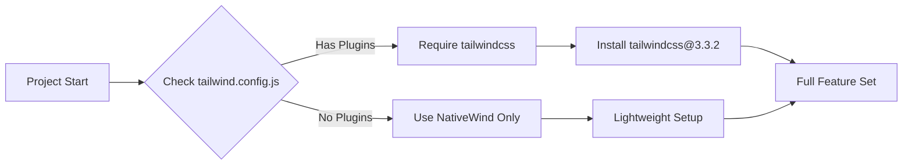

# NativeWind v4 Migration Guide for Expo Projects

## Table of Contents
1. [Overview](#overview)
2. [Current State Analysis](#current-state-analysis)
3. [Step-by-Step Migration Process](#step-by-step-migration-process)
4. [NativeWind v4 Plugin Architecture](#nativewind-v4-plugin-architecture)
5. [Dependency Model Changes](#dependency-model-changes)
6. [EAS Build Configuration](#eas-build-configuration)
7. [Troubleshooting Common Issues](#troubleshooting-common-issues)
8. [Actionable Checklist](#actionable-checklist)

## Overview

This guide provides a comprehensive migration path from NativeWind v2.x to v4.x within an Expo project, addressing the critical Babel configuration issues and EAS build discrepancies.

### Key Changes in NativeWind v4
- **New Babel Plugin**: `nativewind/babel` replaces the old plugin system
- **Removed tailwindcss dependency** for most use cases
- **New preset system**: No longer requires `nativewind/preset`
- **Improved TypeScript support** with better type definitions
- **Enhanced EAS Build compatibility**

## Current State Analysis

Based on your project configuration, I've identified the following issues:

### Issues Found:
1. **Mixed v2/v4 Configuration**: Your [`tailwind.config.js`](tailwind.config.js:8) has a comment indicating v2 but uses v4 syntax
2. **Babel Plugin Error**: The error `.plugins is not a valid Plugin property` indicates incorrect Babel configuration
3. **Backup File Presence**: [`tailwind.config.js.bak`](tailwind.config.js.bak:4) contains v2 preset reference
4. **Missing tailwindcss dependency**: v4 requires tailwindcss v3.3.2 for certain features

### Current Configuration State:
- ✅ NativeWind v4.1.19 installed in [`package.json`](package.json:29)
- ✅ Babel plugin `'nativewind/babel'` present in [`babel.config.js`](babel.config.js:7)
- ❌ Incorrect tailwind.config.js structure (mixed v2/v4)
- ❌ Missing tailwindcss dependency for advanced features

## Step-by-Step Migration Process

### Step 1: Update package.json Dependencies

```json
{
  "dependencies": {
    "nativewind": "^4.1.19",
    "tailwindcss": "3.3.2"
  },
  "devDependencies": {
    "@types/react": "~19.1.0",
    "babel-preset-expo": "^54.0.6"
  }
}
```

**Important**: Only install `tailwindcss@3.3.2` if you need:
- Custom plugins in tailwind.config.js
- Advanced CSS features
- Web platform support

### Step 2: Fix babel.config.js

Your current [`babel.config.js`](babel.config.js) has the correct plugin but may have ordering issues:

```javascript
module.exports = function (api) {
  api.cache(true);
  return {
    presets: ["babel-preset-expo"],
    plugins: [
      // NativeWind plugin MUST come before other plugins
      'nativewind/babel',
      [
        'module-resolver',
        {
          root: ['./src'],
          alias: {
            '@': './src',
            'react-native/Libraries/Components/Slider/Slider': '@react-native-community/slider',
          },
        },
      ],
      // Reanimated plugin must be last
      'react-native-reanimated/plugin',
    ],
  };
};
```

### Step 3: Update tailwind.config.js

Replace your current [`tailwind.config.js`](tailwind.config.js) with this v4-compatible version:

```javascript
/** @type {import('tailwindcss').Config} */
module.exports = {
  content: ["./app/**/*.{js,jsx,ts,tsx}", "./src/**/*.{js,jsx,ts,tsx}"],
  // Remove v2 preset reference - not needed in v4
  theme: {
    extend: {
      colors: {
        primary: '#007AFF',
        secondary: '#5856D6',
        success: '#34C759',
        warning: '#FF9500',
        error: '#FF3B30',
        background: '#F2F2F7',
        surface: '#FFFFFF',
        text: '#1C1C1E',
        textSecondary: '#8E8E93',
        'primary-light': '#5AC8FA',
        'primary-dark': '#0051D5',
        'surface-elevated': '#FFFFFF',
        'border-light': '#E5E5EA',
        'shadow-light': 'rgba(0, 0, 0, 0.05)',
        'shadow-medium': 'rgba(0, 0, 0, 0.1)',
      },
      fontFamily: {
        sans: ['System', '-apple-system', 'BlinkMacSystemFont', 'Segoe UI', 'Roboto', 'Helvetica Neue', 'Arial', 'sans-serif'],
      },
      fontSize: {
        'xs': ['12px', { lineHeight: '16px', fontWeight: '400' }],
        'sm': ['14px', { lineHeight: '20px', fontWeight: '400' }],
        'base': ['16px', { lineHeight: '24px', fontWeight: '400' }],
        'lg': ['18px', { lineHeight: '26px', fontWeight: '500' }],
        'xl': ['20px', { lineHeight: '28px', fontWeight: '500' }],
        '2xl': ['24px', { lineHeight: '32px', fontWeight: '600' }],
        '3xl': ['28px', { lineHeight: '36px', fontWeight: '700' }],
        '4xl': ['32px', { lineHeight: '40px', fontWeight: '700' }],
        'h1': ['28px', { lineHeight: '36px', fontWeight: '700' }],
        'h2': ['24px', { lineHeight: '32px', fontWeight: '600' }],
        'h3': ['20px', { lineHeight: '28px', fontWeight: '600' }],
        'h4': ['18px', { lineHeight: '26px', fontWeight: '500' }],
      },
      spacing: {
        '0.5': '2px', '1': '4px', '1.5': '6px', '2': '8px', '2.5': '10px',
        '3': '12px', '3.5': '14px', '4': '16px', '5': '20px', '6': '24px',
        '7': '28px', '8': '32px', '9': '36px', '10': '40px', '11': '44px',
        '12': '48px', '14': '56px', '16': '64px', '20': '80px', '24': '96px',
        '28': '112px', '32': '128px',
      },
      borderRadius: {
        'none': '0', 'sm': '4px', 'base': '8px', 'md': '12px', 'lg': '16px',
        'xl': '20px', '2xl': '24px', '3xl': '32px', 'full': '9999px',
      },
    },
  },
  plugins: [],
}
```

### Step 4: Update TypeScript Definitions

Ensure your [`nativewind-env.d.ts`](nativewind-env.d.ts) contains:

```typescript
/// <reference types="nativewind/types" />
```

### Step 5: Clean Installation

```bash
# Remove node_modules and lock file
rm -rf node_modules package-lock.json

# Clean npm cache
npm cache clean --force

# Install dependencies
npm install

# Rebuild patches if using patch-package
npm run postinstall
```

## NativeWind v4 Plugin Architecture

### Babel Plugin Changes

NativeWind v4 introduces a simplified Babel plugin architecture:



### Key Architectural Changes:

1. **Single Plugin**: `nativewind/babel` handles all transformations
2. **No Preset Required**: Removed dependency on `nativewind/preset`
3. **Runtime Integration**: Direct integration with React Native's style system
4. **Improved Performance**: Reduced bundle size and faster compilation

## Dependency Model Changes

### When tailwindcss is NOT Needed:

- Basic NativeWind functionality
- Standard utility classes
- Native platform builds (iOS/Android)
- Most common use cases

### When tailwindcss v3.3.2 IS Required:

```bash
npm install --save-dev tailwindcss@3.3.2
```

- Custom Tailwind plugins in [`tailwind.config.js`](tailwind.config.js)
- Advanced CSS features (custom functions, complex calculations)
- Web platform support
- PostCSS processing requirements

### Dependency Resolution Flow:



## EAS Build Configuration

### Common EAS Build Issues

The discrepancy between local `npm ci` and EAS builds typically stems from:

1. **Lockfile Synchronization**: Different dependency resolution
2. **Cache Invalidation**: Stale build caches
3. **Environment Differences**: Node.js version variations
4. **Platform-specific Dependencies**: Native module compilation

### EAS Build Profile Configuration

Update your [`eas.json`](eas.json) with optimized build settings:

```json
{
  "cli": {
    "version": ">= 16.26.0",
    "appVersionSource": "remote"
  },
  "build": {
    "development": {
      "developmentClient": true,
      "distribution": "internal",
      "cache": {
        "disabled": false,
        "key": "nativewind-v4-${hash}"
      }
    },
    "preview": {
      "distribution": "internal",
      "cache": {
        "disabled": false,
        "key": "nativewind-v4-${hash}"
      },
      "env": {
        "NODE_ENV": "production"
      }
    },
    "production": {
      "autoIncrement": true,
      "cache": {
        "disabled": false,
        "key": "nativewind-v4-${hash}"
      },
      "env": {
        "NODE_ENV": "production"
      }
    }
  },
  "submit": {
    "production": {}
  }
}
```

### Lockfile Synchronization Strategy

```bash
# 1. Ensure consistent Node.js version
node --version  # Should match EAS build environment

# 2. Clean install with exact versions
rm -rf node_modules package-lock.json
npm install

# 3. Verify lockfile integrity
npm ci

# 4. Test build locally
eas build --platform ios --profile development --local
```

## Troubleshooting Common Issues

### Babel Plugin Error: `.plugins is not a valid Plugin property`

**Cause**: Incorrect Babel configuration or plugin ordering

**Solution**:
1. Ensure `'nativewind/babel'` is the first plugin
2. Verify plugin syntax is correct (no nested `.plugins` property)
3. Check for conflicting plugins

### EAS Build Dependency Resolution Failures

**Cause**: Lockfile synchronization issues

**Solution**:
```bash
# 1. Clear all caches
eas build:clear-cache
npm cache clean --force

# 2. Regenerate lockfile
rm package-lock.json
npm install

# 3. Verify with dry run
eas build --platform all --profile preview --dry-run
```

### TypeScript Type Errors

**Cause**: Missing or incorrect type definitions

**Solution**:
```typescript
// In nativewind-env.d.ts
/// <reference types="nativewind/types" />

// In tsconfig.json
{
  "compilerOptions": {
    "types": ["nativewind/types"]
  }
}
```

### Runtime Style Not Applied

**Cause**: Missing Babel plugin or incorrect import

**Solution**:
1. Verify `'nativewind/babel'` is in [`babel.config.js`](babel.config.js)
2. Check that components use `className` prop correctly
3. Ensure Metro bundler is restarted

## Actionable Checklist

### Pre-Migration Checklist

- [ ] Backup current configuration files
- [ ] Note any custom Tailwind plugins being used
- [ ] Document current NativeWind usage patterns
- [ ] Check current Node.js and Expo SDK versions

### Migration Steps

- [ ] Update [`package.json`](package.json) with correct dependencies
- [ ] Fix [`babel.config.js`](babel.config.js) plugin ordering
- [ ] Update [`tailwind.config.js`](tailwind.config.js) for v4 compatibility
- [ ] Verify [`nativewind-env.d.ts`](nativewind-env.d.ts) type definitions
- [ ] Clean install dependencies
- [ ] Test local development build

### EAS Build Preparation

- [ ] Update [`eas.json`](eas.json) with cache configuration
- [ ] Synchronize package-lock.json
- [ ] Clear EAS build cache
- [ ] Test local EAS build
- [ ] Verify production build configuration

### Post-Migration Verification

- [ ] Test all screens with NativeWind styles
- [ ] Verify TypeScript compilation
- [ ] Check bundle size impact
- [ ] Test on all target platforms
- [ ] Validate EAS build success

### Performance Optimization

- [ ] Monitor bundle size changes
- [ ] Test style application performance
- [ ] Verify Metro bundler optimization
- [ ] Check memory usage during development

## Emergency Rollback Plan

If migration fails, rollback steps:

1. Restore backed-up configuration files
2. Reinstall previous NativeWind version:
   ```bash
   npm install nativewind@2.x
   ```
3. Restore v2 Babel configuration
4. Revert tailwind.config.js to v2 format
5. Clear caches and rebuild

## Support Resources

- [NativeWind v4 Documentation](https://www.nativewind.dev/v4/)
- [Expo EAS Build Troubleshooting](https://docs.expo.dev/build-reference/troubleshooting/)
- [React Native Metro Configuration](https://reactnative.dev/docs/metro)