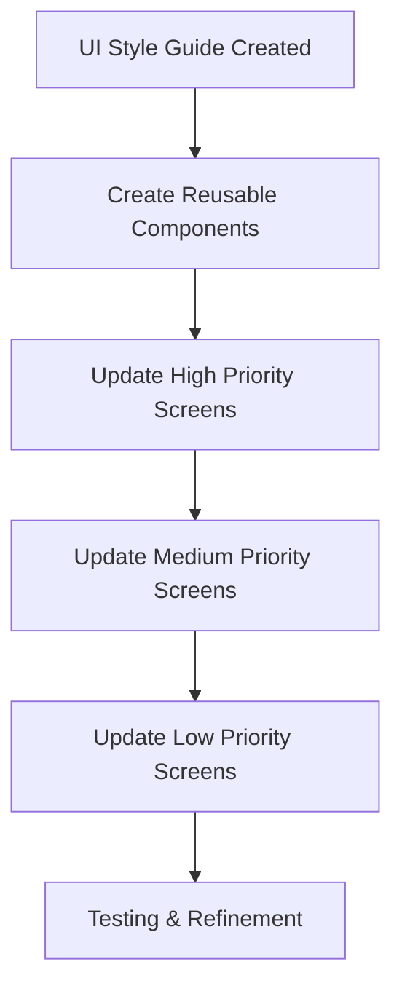

# Pildhora UI Implementation Plan

## Overview
This plan outlines the systematic approach to apply the successful medication list design patterns throughout the entire Pildhora application for consistent, professional UI.

## Implementation Strategy



## Phase 1: Foundation Components

### 1.1 Create Reusable UI Components
**Location**: `src/components/ui/`

**Components to Create**:
- `Card.tsx` - Standardized card component with shadows and borders
- `Button.tsx` - Consistent button styling
- `Header.tsx` - Standard header pattern
- `Container.tsx` - Wrapper for consistent spacing
- `Separator.tsx` - Alternative to divider lines (gap-based)

### 1.2 Component Specifications

#### Card Component
```tsx
interface CardProps {
  children: React.ReactNode;
  className?: string;
  shadow?: boolean;
  border?: boolean;
}

export const Card: React.FC<CardProps> = ({ 
  children, 
  className = "", 
  shadow = true, 
  border = true 
}) => (
  <View className={`bg-white rounded-xl p-4 ${shadow ? 'shadow-sm' : ''} ${border ? 'border border-gray-200' : ''} ${className}`}>
    {children}
  </View>
);
```

#### Button Component
```tsx
interface ButtonProps {
  children: React.ReactNode;
  onPress: () => void;
  variant?: 'primary' | 'secondary' | 'danger';
  size?: 'sm' | 'md' | 'lg';
  disabled?: boolean;
  className?: string;
}

export const Button: React.FC<ButtonProps> = ({ 
  children, 
  onPress, 
  variant = 'primary', 
  size = 'md', 
  disabled = false,
  className = "" 
}) => {
  const baseClasses = "px-4 py-2 rounded-lg font-semibold";
  const variantClasses = {
    primary: "bg-blue-500 text-white",
    secondary: "bg-gray-800 text-white shadow-sm", 
    danger: "bg-red-500 text-white"
  };
  const sizeClasses = {
    sm: "px-3 py-1 text-sm",
    md: "px-4 py-2 text-base",
    lg: "px-6 py-3 text-lg"
  };
  
  return (
    <TouchableOpacity
      onPress={onPress}
      disabled={disabled}
      className={`${baseClasses} ${variantClasses[variant]} ${sizeClasses[size]} ${disabled ? 'opacity-50' : ''} ${className}`}
    >
      {children}
    </TouchableOpacity>
  );
};
```

## Phase 2: Screen Updates (Priority Order)

### 2.1 High Priority Screens

#### Patient Medication List (`app/patient/medications/index.tsx`)
- **Current Issues**: Uses FlatList with dividers, inconsistent spacing
- **Required Changes**:
  - Replace FlatList with gap-based View component
  - Apply Card component to each medication item
  - Remove ItemSeparatorComponent
  - Update container styling

#### Patient History (`app/patient/history/index.tsx`)
- **Current Issues**: Inconsistent button styles, mixed spacing
- **Required Changes**:
  - Apply Button component for all actions
  - Apply Card component to history items
  - Standardize filter buttons

#### Medication Forms (`app/patient/medications/add.tsx`, `app/patient/medications/[id].tsx`)
- **Current Issues**: Basic styling, inconsistent elements
- **Required Changes**:
  - Apply Card component to form sections
  - Apply Button component for actions
  - Standardize input styling

### 2.2 Medium Priority Screens

#### Caregiver Dashboard (`app/caregiver/dashboard.tsx`)
- **Current Status**: Already has good card design
- **Required Changes**:
  - Verify consistency with new components
  - Apply Button component where needed
  - Ensure all cards follow style guide

#### Patient Home (`app/patient/home.tsx`)
- **Current Status**: ✅ Already updated with new design
- **Required Changes**:
  - Verify consistency with style guide
  - Apply reusable components where beneficial

### 2.3 Low Priority Screens

#### Authentication Screens (`app/auth/login.tsx`, `app/auth/signup.tsx`)
- **Current Issues**: Basic styling
- **Required Changes**:
  - Apply Card component to form containers
  - Apply Button component to actions
  - Standardize input fields

## Phase 3: Implementation Steps

### 3.1 Component Creation
1. Create `src/components/ui/` directory
2. Implement base components (Card, Button, Header, Container)
3. Add TypeScript interfaces for all components
4. Export components properly

### 3.2 Screen Updates
1. Update screens in priority order
2. Replace inconsistent styling with reusable components
3. Remove all divider lines (`h-px bg-gray-200`)
4. Apply consistent spacing (`gap-3`, `mb-3`)
5. Test each screen individually

### 3.3 Global Styles
1. Update `tailwind.config.js` if needed for custom utilities
2. Ensure consistent color usage
3. Verify responsive design across screen sizes

## Phase 4: Quality Assurance

### 4.1 Testing Checklist
- [ ] Visual consistency across all screens
- [ ] Responsive design on different screen sizes
- [ ] Accessibility compliance
- [ ] Performance optimization
- [ ] Cross-platform compatibility

### 4.2 Success Metrics
- **Before**: Inconsistent styling, distracting dividers
- **After**: Consistent card-based design, clean spacing
- **Target**: 100% of screens follow style guide

## Implementation Timeline

**Week 1**: Component creation and foundation setup
**Week 2**: High-priority screen updates
**Week 3**: Medium-priority screen updates
**Week 4**: Low-priority screen updates and testing

## Dependencies

### Required
- Existing UI components analysis
- Style guide adherence
- Cross-screen testing
- Component reusability verification

### Optional
- Design system tokens (if expanding)
- Component library (if scaling)
- Automated testing tools

## Risk Mitigation

### Potential Issues
- Breaking existing functionality during component replacement
- Inconsistent application of new patterns
- Performance impact of new components

### Mitigation Strategies
- Incremental implementation (screen by screen)
- Thorough testing before deployment
- Rollback plan if critical issues arise

## Success Criteria

1. All screens follow the UI style guide
2. No divider lines remain in the application
3. Consistent card-based design throughout
4. Reusable components are properly implemented
5. Visual hierarchy is maintained across all screens
6. Responsive design works on all target devices

This implementation plan ensures that the successful medication list design patterns are systematically applied throughout the entire Pildhora application, creating a consistent, professional user experience.