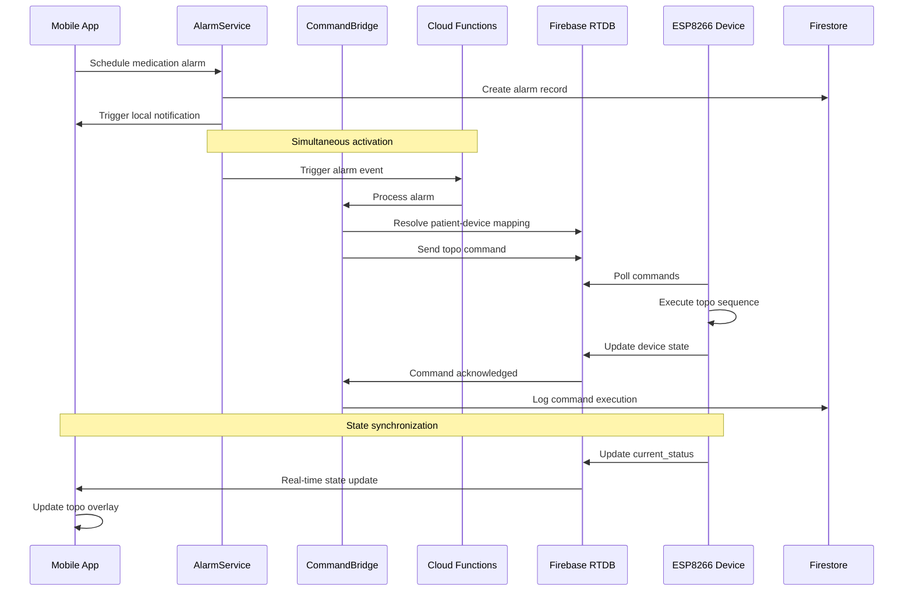

# Comprehensive Integration Plan: Medication Alarms to Topo Commands

## Executive Summary

This document outlines a comprehensive integration plan to connect the existing medication alarm system with topo commands for ESP8266-based medication dispensing devices (device-m1947 family). The integration will automatically trigger device topo commands when mobile medication alarms are activated, providing synchronized alarm experiences across mobile apps and physical devices.

## Current System Analysis

### Existing Components

1. **Medication Alarm System**
   - `AlarmService.ts` - Platform-specific alarm scheduling using expo-notifications
   - `alarmUtils.ts` - Medication to alarm configuration utilities
   - Supports iOS and Android native notifications with critical alerts

2. **Topo Alarm System**
   - `topoAlarmService.ts` - Handles topo alarm resolution and intake recording
   - `useTopoAlarm.ts` - React hook for monitoring topo state in RTDB
   - `TopoAlarmOverlay.tsx` - Full-screen alarm overlay component

3. **Device Integration**
   - `deviceCommands.ts` - Commands sent to ESP8266 devices via RTDB
   - `deviceActions.ts` - Caregiver-triggered device actions
   - Existing RTDB structure for device commands and state

4. **Cloud Functions**
   - Real-time functions for device state mirroring
   - Firestore triggers for medication events
   - Push notification system for critical events

---

## 1. Medication Command Bridge Service Architecture

### 1.1 Core Service Design

```typescript
// New service: src/services/medicationCommandBridge.ts
export class MedicationCommandBridge {
  private static instance: MedicationCommandBridge;
  private commandQueue: Map<string, MedicationCommand[]> = new Map();
  private retryConfig = { maxRetries: 3, delayMs: 2000 };
  
  static getInstance(): MedicationCommandBridge {
    if (!MedicationCommandBridge.instance) {
      MedicationCommandBridge.instance = new MedicationCommandBridge();
    }
    return MedicationCommandBridge.instance;
  }
}

interface MedicationCommand {
  medicationId: string;
  medicationName: string;
  patientId: string;
  deviceId: string;
  scheduledTime: Date;
  commandType: 'topo' | 'buzzer' | 'led';
  priority: 'high' | 'normal' | 'low';
  maxRetries: number;
  createdAt: Date;
}
```

### 1.2 Patient-Device Resolution Logic

```typescript
// Enhanced patient-device resolution
async function resolvePatientDevice(medicationId: string): Promise<{
  patientId: string;
  deviceId: string;
  caregiverId?: string;
}> {
  const db = await getDbInstance();
  
  // Query medication to get patientId
  const medicationDoc = await db.collection('medications').doc(medicationId).get();
  const medication = medicationDoc.data();
  
  if (!medication) {
    throw new Error(`Medication ${medicationId} not found`);
  }
  
  // Query patient to get deviceId
  const patientDoc = await db.collection('users').doc(medication.patientId).get();
  const patient = patientDoc.data();
  
  return {
    patientId: medication.patientId,
    deviceId: patient?.deviceId,
    caregiverId: medication.caregiverId
  };
}
```

### 1.3 Command Queuing and Retry Mechanisms

```typescript
class CommandQueue {
  private queue: PriorityQueue<MedicationCommand>;
  private processing = false;
  
  async enqueue(command: MedicationCommand): Promise<void> {
    this.queue.enqueue(command, this.getPriorityWeight(command.priority));
    if (!this.processing) {
      this.processQueue();
    }
  }
  
  private async processQueue(): Promise<void> {
    this.processing = true;
    
    while (!this.queue.isEmpty()) {
      const command = this.queue.dequeue();
      await this.processCommand(command);
    }
    
    this.processing = false;
  }
  
  private async processCommand(command: MedicationCommand): Promise<void> {
    let attempts = 0;
    
    while (attempts < command.maxRetries) {
      try {
        await this.executeCommand(command);
        await this.logSuccess(command);
        break; // Success, exit retry loop
      } catch (error) {
        attempts++;
        if (attempts >= command.maxRetries) {
          await this.logFailure(command, error);
          await this.handleFailedCommand(command, error);
        } else {
          await this.delay(this.retryConfig.delayMs * attempts);
        }
      }
    }
  }
}
```

### 1.4 Timeout Handling and Error Recovery

```typescript
interface CommandTimeout {
  commandId: string;
  timeoutMs: number;
  recoveryAction: 'retry' | 'skip' | 'escalate';
}

class TimeoutManager {
  private timeouts = new Map<string, NodeJS.Timeout>();
  
  setTimeout(command: MedicationCommand): void {
    const timeoutId = setTimeout(() => {
      this.handleTimeout(command);
    }, 30000); // 30 second timeout
    
    this.timeouts.set(command.medicationId, timeoutId);
  }
  
  clearTimeout(commandId: string): void {
    const timeout = this.timeouts.get(commandId);
    if (timeout) {
      clearTimeout(timeout);
      this.timeouts.delete(commandId);
    }
  }
  
  private async handleTimeout(command: MedicationCommand): Promise<void> {
    console.warn(`Command timeout for medication ${command.medicationId}`);
    
    switch (command.priority) {
      case 'high':
        await this.escalateTimeout(command);
        break;
      case 'normal':
        await this.retryCommand(command);
        break;
      case 'low':
        await this.skipCommand(command);
        break;
    }
  }
}
```

---

## 2. Cloud Functions Integration

### 2.1 Scheduled Functions for Medication Monitoring

```typescript
// functions/src/medicationMonitor.ts
export const monitorMedicationSchedules = functions.pubsub
  .schedule('every 1 minutes')
  .onRun(async (context) => {
    const now = new Date();
    const fiveMinutesFromNow = new Date(now.getTime() + 5 * 60 * 1000);
    
    // Find medications scheduled within the next 5 minutes
    const upcomingMedications = await getUpcomingMedications(now, fiveMinutesFromNow);
    
    for (const medication of upcomingMedications) {
      await prepareMedicationCommand(medication);
    }
  });

async function getUpcomingMedications(startTime: Date, endTime: Date) {
  const db = admin.firestore();
  
  // Query medications with times falling within the window
  // This requires careful indexing and query optimization
  const snapshot = await db.collection('medications')
    .where('scheduleWindow', '>=', startTime)
    .where('scheduleWindow', '<=', endTime)
    .get();
    
  return snapshot.docs.map(doc => ({ id: doc.id, ...doc.data() }));
}
```

### 2.2 Real-time Functions for Medication Events

```typescript
// Enhanced real-time trigger for medication alarms
export const onMedicationAlarmTriggered = functions.firestore
  .document('medicationAlarms/{alarmId}')
  .onCreate(async (snap, context) => {
    const alarmData = snap.data();
    
    try {
      await processMedicationAlarm(alarmData);
    } catch (error) {
      console.error('Error processing medication alarm:', error);
      await logAlarmError(alarmData, error);
    }
  });

async function processMedicationAlarm(alarmData: any): Promise<void> {
  const { medicationId, patientId, scheduledTime } = alarmData;
  
  // Resolve patient-device mapping
  const deviceInfo = await resolvePatientDevice(medicationId);
  
  if (!deviceInfo.deviceId) {
    throw new Error(`No device found for patient ${patientId}`);
  }
  
  // Create and queue topo command
  const command: MedicationCommand = {
    medicationId,
    medicationName: alarmData.medicationName,
    patientId,
    deviceId: deviceInfo.deviceId,
    scheduledTime: new Date(scheduledTime),
    commandType: 'topo',
    priority: 'high',
    maxRetries: 3,
    createdAt: new Date()
  };
  
  await commandBridge.enqueue(command);
}
```

### 2.3 Command Execution with Error Handling

```typescript
// Enhanced device command execution
export const executeDeviceCommand = functions.https.onCall(async (data, context) => {
  // Validate authentication
  if (!context.auth) {
    throw new functions.https.HttpsError('unauthenticated', 'User must be authenticated');
  }
  
  const { deviceId, command, medicationId } = data;
  
  try {
    // Check device connectivity
    const deviceState = await getDeviceState(deviceId);
    
    if (!deviceState.is_online) {
      throw new Error(`Device ${deviceId} is offline`);
    }
    
    // Execute command
    await sendDeviceCommand(deviceId, command);
    
    // Log successful execution
    await logCommandExecution({
      deviceId,
      command,
      medicationId,
      userId: context.auth.uid,
      timestamp: new Date(),
      status: 'success'
    });
    
    return { success: true, message: 'Command executed successfully' };
    
  } catch (error) {
    // Log failure and handle retry
    await logCommandExecution({
      deviceId,
      command,
      medicationId,
      userId: context.auth.uid,
      timestamp: new Date(),
      status: 'failed',
      error: error.message
    });
    
    throw new functions.https.HttpsError('internal', error.message);
  }
});
```

---

## 3. Data Flow Design

### 3.1 Complete End-to-End Flow



### 3.2 Synchronization Between Mobile Alarms and Device Commands

```typescript
class AlarmSynchronizer {
  private syncTolerance = 5000; // 5 seconds tolerance
  
  async synchronizeAlarm(medicationId: string, scheduledTime: Date): Promise<void> {
    const commands = await Promise.all([
      this.triggerMobileAlarm(medicationId, scheduledTime),
      this.triggerDeviceCommand(medicationId, scheduledTime)
    ]);
    
    // Verify synchronization
    const mobileTriggered = commands[0];
    const deviceTriggered = commands[1];
    
    if (!mobileTriggered || !deviceTriggered) {
      await this.handleSynchronizationFailure(medicationId, scheduledTime);
    }
    
    // Log synchronization event
    await this.logSynchronization(medicationId, scheduledTime, {
      mobile: mobileTriggered,
      device: deviceTriggered,
      timestamp: new Date()
    });
  }
  
  private async triggerMobileAlarm(medicationId: string, scheduledTime: Date): Promise<boolean> {
    try {
      const alarmService = new AlarmService();
      const config = await this.buildAlarmConfig(medicationId, scheduledTime);
      const result = await alarmService.createAlarm(config);
      return result.success;
    } catch (error) {
      console.error('Mobile alarm trigger failed:', error);
      return false;
    }
  }
  
  private async triggerDeviceCommand(medicationId: string, scheduledTime: Date): Promise<boolean> {
    try {
      const bridge = MedicationCommandBridge.getInstance();
      const deviceInfo = await resolvePatientDevice(medicationId);
      
      const command: MedicationCommand = {
        medicationId,
        medicationName: await this.getMedicationName(medicationId),
        patientId: deviceInfo.patientId,
        deviceId: deviceInfo.deviceId,
        scheduledTime,
        commandType: 'topo',
        priority: 'high',
        maxRetries: 3,
        createdAt: new Date()
      };
      
      await bridge.enqueue(command);
      return true;
    } catch (error) {
      console.error('Device command trigger failed:', error);
      return false;
    }
  }
}
```

### 3.3 Event Tracking and Notification Systems

```typescript
interface MedicationEvent {
  id: string;
  type: 'alarm_triggered' | 'command_sent' | 'command_acknowledged' | 'alarm_resolved';
  medicationId: string;
  patientId: string;
  deviceId: string;
  timestamp: Date;
  metadata: {
    scheduledTime: Date;
    executionTime?: Date;
    commandId?: string;
    error?: string;
  };
}

class EventTracker {
  async trackEvent(event: MedicationEvent): Promise<void> {
    // Store in Firestore for historical tracking
    await admin.firestore().collection('medicationEvents').add({
      ...event,
      timestamp: admin.firestore.FieldValue.serverTimestamp()
    });
    
    // Send real-time updates to caregivers
    await this.notifyCaregivers(event);
    
    // Update dashboard metrics
    await this.updateDashboardMetrics(event);
  }
  
  private async notifyCaregivers(event: MedicationEvent): Promise<void> {
    const caregivers = await this.getPatientCaregivers(event.patientId);
    
    for (const caregiver of caregivers) {
      await admin.firestore().collection('criticalEvents').add({
        eventType: 'medication_alarm_sync',
        patientId: event.patientId,
        caregiverId: caregiver.id,
        medicationName: await this.getMedicationName(event.medicationId),
        deviceId: event.deviceId,
        timestamp: admin.firestore.FieldValue.serverTimestamp(),
        read: false
      });
    }
  }
}
```

### 3.4 Recovery Mechanisms for Missed Doses

```typescript
class DoseRecoveryManager {
  async handleMissedDose(medicationId: string, scheduledTime: Date): Promise<void> {
    const recoveryActions = [
      this.sendCaregiverNotification,
      this.scheduleRecoveryAlarm,
      this.updateAdherenceMetrics,
      this.analyzeFailurePattern
    ];
    
    for (const action of recoveryActions) {
      try {
        await action.call(this, medicationId, scheduledTime);
      } catch (error) {
        console.error(`Recovery action failed: ${action.name}`, error);
      }
    }
  }
  
  private async scheduleRecoveryAlarm(medicationId: string, scheduledTime: Date): Promise<void> {
    const recoveryTime = new Date(Date.now() + 15 * 60 * 1000); // 15 minutes later
    
    const alarmService = new AlarmService();
    const config = await this.buildRecoveryAlarmConfig(medicationId, recoveryTime);
    await alarmService.createAlarm(config);
  }
  
  private async analyzeFailurePattern(medicationId: string, scheduledTime: Date): Promise<void> {
    const recentFailures = await this.getRecentFailures(medicationId, 24 * 60 * 60 * 1000); // Last 24 hours
    
    if (recentFailures.length > 3) {
      await this.triggerCaregiverEscalation(medicationId, 'high_failure_rate');
    }
  }
}
```

---

## 4. Security and Permissions Framework

### 4.1 Maintain Existing RTDB Security Rules

```json
// Enhanced RTDB rules to support medication commands
{
  "rules": {
    "devices": {
      "$deviceId": {
        "commands": {
          "topo": {
            ".read": "auth != null && root.child('users').child(auth.uid).child('devices').child($deviceId).val() == true",
            ".write": "auth != null && root.child('users').child(auth.uid).child('devices').child($deviceId).val() == true",
            ".validate": "newData.isBoolean()"
          },
          "medicationAlarm": {
            ".read": "auth != null && root.child('users').child(auth.uid).child('devices').child($deviceId).val() == true",
            ".write": "auth != null && root.child('users').child(auth.uid).child('devices').child($deviceId).val() == true",
            ".validate": "newData.hasChildren(['medicationId', 'scheduledTime', 'timestamp'])"
          }
        },
        "state": {
          ".read": "auth != null && root.child('users').child(auth.uid).child('devices').child($deviceId).val() == true",
          ".write": "auth != null && !root.child('users').child(auth.uid).exists()"
        }
      }
    }
  }
}
```

### 4.2 Add Medication-Specific Permissions

```typescript
// Enhanced Firestore rules for medication commands
rules_version = '2';
service cloud.firestore {
  match /databases/{database}/documents {
    
    function canAccessMedication(medicationId) {
      return exists(/databases/$(database)/documents/medications/$(medicationId)) &&
             get(/databases/$(database)/documents/medications/$(medicationId)).data.patientId == request.auth.uid;
    }
    
    function isCaregiverForPatient(patientId) {
      return get(/databases/$(database)/documents/users/$(request.auth.uid)).data.role == "caregiver" &&
             get(/databases/$(database)/documents/users/$(request.auth.uid)).data.patients.hasAny([patientId]);
    }
    
    match /medicationCommands/{commandId} {
      allow read: if isSignedIn() && (
        resource.data.patientId == request.auth.uid ||
        isCaregiverForPatient(resource.data.patientId)
      );
      
      allow create: if isSignedIn() && (
        canAccessMedication(request.resource.data.medicationId) ||
        isCaregiverForPatient(request.resource.data.patientId)
      );
      
      allow update: if isSignedIn() && (
        resource.data.patientId == request.auth.uid ||
        isCaregiverForPatient(resource.data.patientId)
      );
    }
    
    match /medicationAlarms/{alarmId} {
      allow read: if isSignedIn() && (
        resource.data.patientId == request.auth.uid ||
        isCaregiverForPatient(resource.data.patientId)
      );
      
      allow create: if isSignedIn() && (
        canAccessMedication(request.resource.data.medicationId) ||
        isCaregiverForPatient(request.resource.data.patientId)
      );
    }
  }
}
```

### 4.3 Audit Trail for Command Execution

```typescript
interface CommandAuditLog {
  id: string;
  commandId: string;
  medicationId: string;
  patientId: string;
  deviceId: string;
  commandType: 'topo' | 'buzzer' | 'led';
  initiatedBy: string; // user ID or system
  initiatedAt: Date;
  executedAt?: Date;
  acknowledgedAt?: Date;
  status: 'pending' | 'executing' | 'completed' | 'failed' | 'timeout';
  error?: string;
  metadata: {
    retryCount: number;
    timeoutMs: number;
    deviceState: any;
  };
}

class CommandAuditor {
  async logCommand(command: MedicationCommand, action: 'created' | 'executed' | 'completed' | 'failed'): Promise<void> {
    const auditLog: Partial<CommandAuditLog> = {
      commandId: this.generateCommandId(command),
      medicationId: command.medicationId,
      patientId: command.patientId,
      deviceId: command.deviceId,
      commandType: command.commandType,
      initiatedBy: 'system', // or user ID
      initiatedAt: command.createdAt,
      status: this.mapActionToStatus(action),
      metadata: {
        retryCount: 0,
        timeoutMs: 30000,
        deviceState: await this.getDeviceState(command.deviceId)
      }
    };
    
    await admin.firestore().collection('commandAuditLogs').add({
      ...auditLog,
      timestamp: admin.firestore.FieldValue.serverTimestamp()
    });
  }
  
  async getAuditTrail(medicationId: string, startDate: Date, endDate: Date): Promise<CommandAuditLog[]> {
    const snapshot = await admin.firestore().collection('commandAuditLogs')
      .where('medicationId', '==', medicationId)
      .where('timestamp', '>=', startDate)
      .where('timestamp', '<=', endDate)
      .orderBy('timestamp', 'desc')
      .get();
      
    return snapshot.docs.map(doc => ({ id: doc.id, ...doc.data() } as CommandAuditLog));
  }
}
```

### 4.4 Emergency Override Capabilities

```typescript
class EmergencyOverride {
  async triggerEmergencyOverride(deviceId: string, reason: string, userId: string): Promise<void> {
    // Log emergency override attempt
    await this.logEmergencyOverride(deviceId, reason, userId);
    
    // Clear all pending commands
    await this.clearDeviceCommands(deviceId);
    
    // Send emergency command to device
    await sendDeviceCommand(deviceId, {
      emergency: true,
      reason: reason,
      timestamp: Date.now()
    });
    
    // Notify all caregivers
    await this.notifyEmergencyOverride(deviceId, reason, userId);
  }
  
  async clearDeviceCommands(deviceId: string): Promise<void> {
    const rdb = await getRdbInstance();
    await rdb.ref(`devices/${deviceId}/commands`).set({
      topo: false,
      buzzer: false,
      led: false,
      emergency: false,
      clearedAt: Date.now(),
      clearedBy: 'system'
    });
  }
  
  private async logEmergencyOverride(deviceId: string, reason: string, userId: string): Promise<void> {
    await admin.firestore().collection('emergencyOverrides').add({
      deviceId,
      reason,
      triggeredBy: userId,
      triggeredAt: admin.firestore.FieldValue.serverTimestamp(),
      timestamp: admin.firestore.FieldValue.serverTimestamp()
    });
  }
}
```

---

## 5. Implementation Architecture

### 5.1 Service Layer Design

```typescript
// Core service interfaces
interface IMedicationCommandService {
  triggerMedicationAlarm(medicationId: string, scheduledTime: Date): Promise<AlarmResult>;
  executeCommand(command: MedicationCommand): Promise<CommandResult>;
  getCommandStatus(commandId: string): Promise<CommandStatus>;
  cancelCommand(commandId: string): Promise<void>;
}

interface ICommandQueueService {
  enqueue(command: MedicationCommand): Promise<void>;
  dequeue(): Promise<MedicationCommand | null>;
  getQueueStatus(): Promise<QueueStatus>;
  clearQueue(patientId?: string): Promise<void>;
}

interface IDeviceCommandService {
  sendCommand(deviceId: string, command: DeviceCommand): Promise<CommandResult>;
  getDeviceState(deviceId: string): Promise<DeviceState>;
  isDeviceOnline(deviceId: string): Promise<boolean>;
}

// Service implementations
export class MedicationCommandService implements IMedicationCommandService {
  private bridge = MedicationCommandBridge.getInstance();
  private auditor = new CommandAuditor();
  
  async triggerMedicationAlarm(medicationId: string, scheduledTime: Date): Promise<AlarmResult> {
    // Create mobile alarm
    const alarmService = new AlarmService();
    const config = await this.buildAlarmConfig(medicationId, scheduledTime);
    const alarmResult = await alarmService.createAlarm(config);
    
    // Create device command
    const deviceInfo = await resolvePatientDevice(medicationId);
    if (deviceInfo.deviceId) {
      const command = await this.buildDeviceCommand(medicationId, scheduledTime, deviceInfo);
      await this.bridge.enqueue(command);
    }
    
    // Log the synchronized trigger
    await this.auditor.logCommand({
      medicationId,
      medicationName: await this.getMedicationName(medicationId),
      patientId: deviceInfo.patientId,
      deviceId: deviceInfo.deviceId,
      scheduledTime,
      commandType: 'topo',
      priority: 'high',
      maxRetries: 3,
      createdAt: new Date()
    }, 'created');
    
    return alarmResult;
  }
}
```

### 5.2 Database Schema Updates

```typescript
// Firestore schema updates

// New collection: medicationCommands
interface MedicationCommandDocument {
  id: string;
  medicationId: string;
  patientId: string;
  deviceId: string;
  commandType: 'topo' | 'buzzer' | 'led';
  status: 'pending' | 'executing' | 'completed' | 'failed' | 'cancelled';
  scheduledTime: Timestamp;
  executedAt?: Timestamp;
  createdAt: Timestamp;
  updatedAt: Timestamp;
  retryCount: number;
  error?: string;
  metadata: {
    caregiverId?: string;
    alarmId?: string;
    priority: 'high' | 'normal' | 'low';
  };
}

// Enhanced medicationAlarms collection
interface MedicationAlarmDocument {
  id: string;
  medicationId: string;
  patientId: string;
  scheduledTime: Timestamp;
  triggeredAt?: Timestamp;
  status: 'scheduled' | 'triggered' | 'resolved' | 'missed';
  deviceCommandId?: string;
  createdAt: Timestamp;
  resolvedAt?: Timestamp;
  resolution: 'taken' | 'missed' | 'skipped';
  metadata: {
    alarmIds: string[];
    deviceId?: string;
    caregiverId?: string;
  };
}

// New collection: commandAuditLogs
interface CommandAuditLogDocument {
  id: string;
  commandId: string;
  medicationId: string;
  patientId: string;
  deviceId: string;
  action: 'created' | 'executed' | 'completed' | 'failed' | 'cancelled' | 'timeout';
  timestamp: Timestamp;
  userId?: string;
  metadata: {
    retryCount: number;
    error?: string;
    deviceState?: any;
    executionTimeMs?: number;
  };
}

// Enhanced devices collection
interface EnhancedDeviceDocument {
  id: string;
  primaryPatientId: string;
  // ... existing fields
  commandConfig: {
    topoEnabled: boolean;
    buzzerEnabled: boolean;
    ledEnabled: boolean;
    commandTimeout: number; // milliseconds
    maxRetries: number;
    emergencyStopEnabled: boolean;
  };
  lastCommandAt?: Timestamp;
  commandHistory: string[]; // array of command IDs
}
```

### 5.3 Error Handling and Logging Strategy

```typescript
// Centralized error handling
class CommandErrorHandler {
  private errorQueue: Array<{error: Error, context: any, timestamp: Date}> = [];
  
  async handleError(error: Error, context: any): Promise<void> {
    const errorEntry = {
      error,
      context,
      timestamp: new Date()
    };
    
    // Log to audit trail
    await this.logError(errorEntry);
    
    // Determine error severity and action
    const severity = this.classifyError(error);
    
    switch (severity) {
      case 'critical':
        await this.handleCriticalError(errorEntry);
        break;
      case 'warning':
        await this.handleWarningError(errorEntry);
        break;
      case 'info':
        await this.handleInfoError(errorEntry);
        break;
    }
    
    // Add to processing queue
    this.errorQueue.push(errorEntry);
    
    // Process error queue asynchronously
    this.processErrorQueue();
  }
  
  private classifyError(error: Error): 'critical' | 'warning' | 'info' {
    if (error.message.includes('device offline') ||
        error.message.includes('authentication failed') ||
        error.message.includes('database connection')) {
      return 'critical';
    }
    
    if (error.message.includes('timeout') ||
        error.message.includes('retry exhausted')) {
      return 'warning';
    }
    
    return 'info';
  }
  
  private async processErrorQueue(): Promise<void> {
    if (this.errorQueue.length === 0) return;
    
    const error = this.errorQueue.shift()!;
    
    try {
      // Send critical errors to monitoring service
      if (this.classifyError(error.error) === 'critical') {
        await this.sendToMonitoringService(error);
      }
      
      // Attempt recovery for retryable errors
      if (this.isRetryableError(error.error)) {
        await this.scheduleRetry(error);
      }
      
    } catch (processingError) {
      console.error('Error processing error queue:', processingError);
    }
    
    // Continue processing
    setImmediate(() => this.processErrorQueue());
  }
}

// Structured logging
class CommandLogger {
  async logCommandEvent(event: {
    type: string;
    commandId: string;
    medicationId: string;
    patientId: string;
    deviceId: string;
    status: string;
    metadata?: any;
  }): Promise<void> {
    const logEntry = {
      ...event,
      timestamp: new Date().toISOString(),
      service: 'medication-command-bridge',
      version: '1.0.0'
    };
    
    // Log to Firestore
    await admin.firestore().collection('commandLogs').add(logEntry);
    
    // Log to external monitoring service (e.g., DataDog, CloudWatch)
    if (this.isProductionEnvironment()) {
      await this.sendToExternalLogger(logEntry);
    }
    
    // Console log for development
    if (this.isDevelopmentEnvironment()) {
      console.log('[CommandLogger]', logEntry);
    }
  }
}
```

### 5.4 Performance Considerations

```typescript
// Performance monitoring and optimization
class PerformanceMonitor {
  private metrics = {
    commandLatency: new Map<string, number[]>(),
    queueDepth: new Map<string, number>(),
    errorRate: new Map<string, number>(),
    throughput: new Map<string, number>()
  };
  
  async measureCommandExecution<T>(operation: () => Promise<T>, operationName: string): Promise<T> {
    const startTime = Date.now();
    let success = false;
    
    try {
      const result = await operation();
      success = true;
      return result;
    } finally {
      const duration = Date.now() - startTime;
      this.recordLatency(operationName, duration);
      this.recordResult(operationName, success);
    }
  }
  
  private recordLatency(operation: string, latency: number): void {
    const latencies = this.metrics.commandLatency.get(operation) || [];
    latencies.push(latency);
    
    // Keep only last 100 measurements
    if (latencies.length > 100) {
      latencies.shift();
    }
    
    this.metrics.commandLatency.set(operation, latencies);
    
    // Alert if latency is too high
    if (latency > 5000) { // 5 seconds
      this.alertHighLatency(operation, latency);
    }
  }
  
  private async alertHighLatency(operation: string, latency: number): Promise<void> {
    await admin.firestore().collection('performanceAlerts').add({
      type: 'high_latency',
      operation,
      latency,
      threshold: 5000,
      timestamp: admin.firestore.FieldValue.serverTimestamp()
    });
  }
  
  async getPerformanceMetrics(): Promise<{
    averageLatency: number;
    queueDepth: number;
    errorRate: number;
    throughput: number;
  }> {
    const latencies = Array.from(this.metrics.commandLatency.values()).flat();
    const averageLatency = latencies.length > 0 
      ? latencies.reduce((a, b) => a + b, 0) / latencies.length 
      : 0;
    
    return {
      averageLatency,
      queueDepth: this.getCurrentQueueDepth(),
      errorRate: this.getCurrentErrorRate(),
      throughput: this.getCurrentThroughput()
    };
  }
}

// Connection pooling and resource management
class ResourceManager {
  private connectionPool: any[] = [];
  private maxConnections = 10;
  
  async getConnection(): Promise<any> {
    if (this.connectionPool.length > 0) {
      return this.connectionPool.pop();
    }
    
    // Create new connection if under limit
    if (this.connectionPool.length + this.activeConnections < this.maxConnections) {
      return await this.createConnection();
    }
    
    // Wait for available connection
    return await this.waitForConnection();
  }
  
  async releaseConnection(connection: any): Promise<void> {
    if (connection && this.isConnectionHealthy(connection)) {
      this.connectionPool.push(connection);
    } else {
      await this.cleanupConnection(connection);
    }
  }
}
```

---

## 6. Testing Strategy

### 6.1 Unit Tests for Each Component

```typescript
// Test structure: tests/unit/medication-command-bridge/
describe('MedicationCommandBridge', () => {
  let bridge: MedicationCommandBridge;
  let mockDatabase: jest.Mocked<any>;
  
  beforeEach(() => {
    bridge = MedicationCommandBridge.getInstance();
    mockDatabase = createMockDatabase();
  });
  
  describe('enqueue', () => {
    it('should enqueue valid medication command', async () => {
      const command: MedicationCommand = {
        medicationId: 'med-123',
        medicationName: 'Aspirin',
        patientId: 'patient-456',
        deviceId: 'device-789',
        scheduledTime: new Date(),
        commandType: 'topo',
        priority: 'high',
        maxRetries: 3,
        createdAt: new Date()
      };
      
      await bridge.enqueue(command);
      
      expect(mockDatabase.collection).toHaveBeenCalledWith('medicationCommands');
    });
    
    it('should throw error for invalid medication ID', async () => {
      const invalidCommand = { ...validCommand, medicationId: '' };
      
      await expect(bridge.enqueue(invalidCommand))
        .rejects.toThrow('Invalid medication ID');
    });
  });
  
  describe('patient-device resolution', () => {
    it('should resolve patient and device IDs correctly', async () => {
      const medicationId = 'med-123';
      const mockMedication = {
        patientId: 'patient-456',
        caregiverId: 'caregiver-789'
      };
      const mockPatient = {
        deviceId: 'device-789'
      };
      
      mockDatabase.collection.mockReturnValue({
        doc: jest.fn().mockReturnValue({
          get: jest.fn().mockResolvedValue({
            exists: true,
            data: () => mockPatient
          })
        })
      });
      
      const result = await bridge.resolvePatientDevice(medicationId);
      
      expect(result).toEqual({
        patientId: 'patient-456',
        deviceId: 'device-789',
        caregiverId: 'caregiver-789'
      });
    });
  });
});

// Test for Command Queue
describe('CommandQueue', () => {
  let queue: CommandQueue;
  
  it('should process commands in priority order', async () => {
    const highPriorityCommand = createCommand('high');
    const lowPriorityCommand = createCommand('low');
    const normalPriorityCommand = createCommand('normal');
    
    await queue.enqueue(lowPriorityCommand);
    await queue.enqueue(highPriorityCommand);
    await queue.enqueue(normalPriorityCommand);
    
    const processedCommands = await queue.getProcessedCommands();
    
    expect(processedCommands[0].priority).toBe('high');
    expect(processedCommands[1].priority).toBe('normal');
    expect(processedCommands[2].priority).toBe('low');
  });
});
```

### 6.2 Integration Tests for Complete Flow

```typescript
// Test file: tests/integration/medication-alarm-device-sync/
describe('Medication Alarm to Device Sync Integration', () => {
  let testEnvironment: TestEnvironment;
  
  beforeAll(async () => {
    testEnvironment = await setupTestEnvironment();
    await testEnvironment.seedTestData();
  });
  
  afterAll(async () => {
    await testEnvironment.cleanup();
  });
  
  it('should trigger mobile alarm and device command simultaneously', async () => {
    // Arrange
    const medication = await testEnvironment.createTestMedication({
      name: 'Test Medication',
      times: ['12:00'],
      patientId: 'test-patient'
    });
    
    // Act
    const scheduledTime = new Date();
    scheduledTime.setHours(12, 0, 0, 0);
    
    const alarmPromise = alarmService.createAlarm({
      medicationId: medication.id,
      medicationName: medication.name,
      time: '12:00',
      days: [new Date().getDay()],
      emoji: '💊'
    });
    
    const commandPromise = bridge.triggerMedicationAlarm(medication.id, scheduledTime);
    
    const [alarmResult, commandResult] = await Promise.all([
      alarmPromise,
      commandPromise
    ]);
    
    // Assert
    expect(alarmResult.success).toBe(true);
    expect(commandResult.success).toBe(true);
    
    // Verify synchronization
    const alarmRecord = await testEnvironment.getAlarmRecord(medication.id);
    const commandRecord = await testEnvironment.getCommandRecord(medication.id);
    
    const timeDiff = Math.abs(
      alarmRecord.triggeredAt.getTime() - commandRecord.createdAt.getTime()
    );
    
    expect(timeDiff).toBeLessThan(5000); // Within 5 seconds
  });
  
  it('should handle device offline scenario gracefully', async () => {
    // Arrange
    const medication = await testEnvironment.createTestMedication({
      name: 'Test Medication',
      times: ['12:00'],
      patientId: 'test-patient'
    });
    
    await testEnvironment.setDeviceOffline('test-device');
    
    // Act & Assert
    await expect(bridge.triggerMedicationAlarm(medication.id, new Date()))
      .rejects.toThrow('Device offline');
    
    // Verify alarm still created for mobile
    const alarmRecords = await testEnvironment.getAlarmRecords(medication.id);
    expect(alarmRecords.length).toBeGreaterThan(0);
  });
  
  it('should retry failed commands with exponential backoff', async () => {
    // Arrange
    const medication = await testEnvironment.createTestMedication();
    const command = createCommand('topo');
    
    // Simulate two failures then success
    testEnvironment.mockDeviceCommand
      .mockRejectedValueOnce(new Error('Network error'))
      .mockRejectedValueOnce(new Error('Timeout'))
      .mockResolvedValueOnce({ success: true });
    
    // Act
    await bridge.enqueue(command);
    
    // Wait for retries
    await waitFor(() => 
      expect(testEnvironment.mockDeviceCommand).toHaveBeenCalledTimes(3)
    );
    
    // Assert
    expect(testEnvironment.mockDeviceCommand).toHaveBeenCalledWith(
      command.deviceId,
      { topo: true }
    );
  });
});
```

### 6.3 Manual Testing Procedures

```markdown
# Manual Testing Checklist

## Pre-requisites
- [ ] Test devices provisioned and online
- [ ] Test patient and caregiver accounts created
- [ ] Test medications configured
- [ ] Firebase project configured for testing

## Test Scenarios

### 1. Basic Integration Test
1. Create a test medication with current time + 2 minutes
2. Verify mobile alarm is scheduled
3. Verify device command is queued
4. At scheduled time, verify both alarms trigger simultaneously
5. Verify device responds to topo command
6. Verify intake recording works correctly

### 2. Offline Device Test
1. Take device offline (unplug or disable WiFi)
2. Schedule medication alarm for 5 minutes later
3. Verify mobile alarm triggers
4. Verify system handles device offline gracefully
5. Bring device back online
6. Verify pending commands are executed

### 3. Network Failure Test
1. Disable network connectivity
2. Schedule medication alarm
3. Verify mobile alarm is scheduled
4. Verify device command fails gracefully
5. Re-enable network connectivity
6. Verify system recovers and processes queued commands

### 4. High Load Test
1. Create 50+ medications with overlapping schedules
2. Verify system handles concurrent alarms
3. Monitor performance metrics
4. Verify no commands are lost or duplicated

### 5. Error Recovery Test
1. Simulate various failure conditions:
   - Database connection failures
   - Authentication failures
   - Invalid device responses
   - Timeout scenarios
2. Verify system recovers gracefully
3. Verify error logging works correctly
4. Verify caregiver notifications are sent

### 6. Security Test
1. Attempt unauthorized command execution
2. Verify security rules prevent access
3. Test patient data isolation
4. Verify audit logging works

## Performance Benchmarks
- Command execution latency: < 2 seconds
- Queue processing rate: > 100 commands/minute
- Simultaneous alarm sync: < 5 seconds difference
- Error recovery time: < 30 seconds
- Memory usage: < 100MB per service instance
```

### 6.4 Device-Specific Testing for device-m1947

```typescript
// Specialized tests for ESP8266 device family
describe('ESP8266 Device Integration (device-m1947 family)', () => {
  let deviceTestSuite: DeviceTestSuite;
  
  beforeEach(() => {
    deviceTestSuite = new DeviceTestSuite('esp8266');
  });
  
  it('should handle topo command acknowledgment timing', async () => {
    const device = await deviceTestSuite.provisionTestDevice('esp8266-m1947-001');
    const command = createTopoCommand(device.id);
    
    const acknowledgmentPromise = deviceTestSuite.waitForAcknowledgment(device.id, 10000);
    const commandPromise = bridge.enqueue(command);
    
    const [acknowledgment, commandResult] = await Promise.all([
      acknowledgmentPromise,
      commandPromise
    ]);
    
    expect(acknowledgment.commandId).toBe(command.medicationId);
    expect(commandResult.success).toBe(true);
  });
  
  it('should handle device firmware variations', async () => {
    // Test with different firmware versions
    const firmwareVersions = ['1.0.0', '1.1.0', '2.0.0'];
    
    for (const firmware of firmwareVersions) {
      const device = await deviceTestSuite.provisionTestDeviceWithFirmware(
        'esp8266-m1947-002',
        firmware
      );
      
      const command = createTopoCommand(device.id);
      const result = await bridge.enqueue(command);
      
      expect(result.success).toBe(true);
      await deviceTestSuite.verifyCommandExecuted(device.id, command.medicationId);
    }
  });
  
  it('should handle concurrent commands from multiple patients', async () => {
    const device = await deviceTestSuite.provisionTestDevice('esp8266-m1947-003');
    
    // Simulate commands from different patients for same device
    const commands = [
      createCommand('patient-1', device.id),
      createCommand('patient-2', device.id),
      createCommand('patient-1', device.id) // Duplicate from same patient
    ];
    
    const results = await Promise.all(
      commands.map(cmd => bridge.enqueue(cmd))
    );
    
    // Verify all commands are queued (order may vary)
    expect(results.every(r => r.success)).toBe(true);
    
    // Verify no duplicate execution for same patient/medication/time
    const executions = await deviceTestSuite.getCommandExecutions(device.id);
    const uniqueExecutions = new Set(executions.map(e => e.medicationId + e.scheduledTime));
    
    expect(executions.length).toBe(uniqueExecutions.size);
  });
});

class DeviceTestSuite {
  async provisionTestDevice(deviceId: string, firmwareVersion: string = '1.0.0'): Promise<TestDevice> {
    // Create device in test database
    const device = {
      id: deviceId,
      type: 'esp8266',
      firmwareVersion,
      online: true,
      lastSeen: new Date()
    };
    
    await admin.firestore().collection('testDevices').doc(deviceId).set(device);
    await admin.database().ref(`devices/${deviceId}/state`).set({
      is_online: true,
      current_status: 'idle',
      firmware_version: firmwareVersion,
      last_seen: Date.now()
    });
    
    return device;
  }
  
  async waitForAcknowledgment(deviceId: string, timeoutMs: number): Promise<any> {
    return new Promise((resolve, reject) => {
      const timeout = setTimeout(() => {
        reject(new Error('Acknowledgment timeout'));
      }, timeoutMs);
      
      const listener = admin.database()
        .ref(`devices/${deviceId}/commands`)
        .on('value', (snapshot) => {
          const commands = snapshot.val();
          if (commands && commands.acknowledged) {
            clearTimeout(timeout);
            listener.off();
            resolve(commands.acknowledged);
          }
        });
    });
  }
}
```

### 6.5 Performance and Reliability Testing

```typescript
// Performance testing suite
describe('Performance and Reliability Tests', () => {
  it('should handle 1000+ concurrent medication alarms', async () => {
    const startTime = Date.now();
    const alarmCount = 1000;
    
    const alarms = Array.from({ length: alarmCount }, (_, i) => 
      createMedicationAlarm(`med-${i}`, new Date(Date.now() + i * 1000))
    );
    
    // Measure alarm scheduling performance
    const schedulingPromises = alarms.map(alarm => 
      performanceMonitor.measureCommandExecution(
        () => alarmService.createAlarm(alarm.config),
        `schedule_alarm_${alarm.medicationId}`
      )
    );
    
    const results = await Promise.allSettled(schedulingPromises);
    const endTime = Date.now();
    
    // Performance assertions
    expect(endTime - startTime).toBeLessThan(30000); // Complete within 30 seconds
    expect(results.filter(r => r.status === 'fulfilled').length).toBe(alarmCount);
    
    // Check latency metrics
    const metrics = await performanceMonitor.getPerformanceMetrics();
    expect(metrics.averageLatency).toBeLessThan(1000); // Average < 1 second
  });
  
  it('should maintain performance under sustained load', async () => {
    const duration = 300000; // 5 minutes
    const startTime = Date.now();
    let commandCount = 0;
    
    const loadTest = setInterval(async () => {
      if (Date.now() - startTime < duration) {
        // Generate load
        const command = createCommand(`med-${commandCount++}`);
        await bridge.enqueue(command);
      } else {
        clearInterval(loadTest);
      }
    }, 100); // Every 100ms
    
    // Wait for load test to complete
    await new Promise(resolve => setTimeout(resolve, duration + 5000));
    
    // Verify system stability
    const finalMetrics = await performanceMonitor.getPerformanceMetrics();
    expect(finalMetrics.errorRate).toBeLessThan(0.01); // < 1% error rate
    expect(finalMetrics.queueDepth).toBeLessThan(1000); // Queue doesn't grow indefinitely
  });
  
  it('should recover from database failures', async () => {
    const command = createCommand('med-recovery-test');
    
    // Simulate database failure
    await testEnvironment.simulateDatabaseFailure();
    
    // Commands should be queued for retry
    await expect(bridge.enqueue(command)).rejects.toThrow();
    
    // Recover database
    await testEnvironment.restoreDatabase();
    
    // System should recover automatically
    await waitFor(async () => {
      const pendingCommands = await getPendingCommands();
      return pendingCommands.length > 0;
    }, { timeout: 10000 });
    
    // Verify recovery
    expect(await getPendingCommands()).toContain(command.medicationId);
  });
  
  it('should handle memory leaks during extended operation', async () => {
    const initialMemory = process.memoryUsage().heapUsed;
    
    // Run for extended period
    for (let i = 0; i < 10000; i++) {
      const command = createCommand(`med-memory-test-${i}`);
      await bridge.enqueue(command);
      
      // Force garbage collection if available
      if (global.gc) {
        global.gc();
      }
    }
    
    const finalMemory = process.memoryUsage().heapUsed;
    const memoryIncrease = finalMemory - initialMemory;
    
    // Memory increase should be reasonable (less than 50MB)
    expect(memoryIncrease).toBeLessThan(50 * 1024 * 1024);
  });
});
```

---

## Implementation Timeline

### Phase 1: Core Infrastructure (Weeks 1-2)
- [ ] Implement MedicationCommandBridge service
- [ ] Create command queue and retry mechanisms
- [ ] Add patient-device resolution logic
- [ ] Implement basic RTDB command execution

### Phase 2: Cloud Functions Integration (Weeks 3-4)
- [ ] Create scheduled medication monitoring functions
- [ ] Implement real-time medication event triggers
- [ ] Add command execution with error handling
- [ ] Create audit logging system

### Phase 3: Synchronization and Flow (Weeks 5-6)
- [ ] Implement alarm synchronization
- [ ] Create event tracking system
- [ ] Add recovery mechanisms for missed doses
- [ ] Implement caregiver notification system

### Phase 4: Security and Permissions (Weeks 7-8)
- [ ] Update RTDB security rules
- [ ] Enhance Firestore security rules
- [ ] Implement audit trail system
- [ ] Add emergency override capabilities

### Phase 5: Testing and Optimization (Weeks 9-10)
- [ ] Complete unit test coverage
- [ ] Implement integration tests
- [ ] Conduct performance testing
- [ ] Optimize for production load

### Phase 6: Deployment and Monitoring (Weeks 11-12)
- [ ] Deploy to staging environment
- [ ] Conduct manual testing procedures
- [ ] Monitor performance metrics
- [ ] Deploy to production with gradual rollout

## Risk Mitigation

### High-Risk Areas
1. **Device Connectivity**: Implement robust offline handling and retry mechanisms
2. **Command Ordering**: Ensure commands are processed in the correct sequence
3. **Performance Under Load**: Use connection pooling and resource management
4. **Security Vulnerabilities**: Comprehensive security testing and audit logging

### Mitigation Strategies
1. **Incremental Deployment**: Roll out features gradually with monitoring
2. **Comprehensive Testing**: Multiple layers of testing including load testing
3. **Monitoring and Alerting**: Real-time monitoring of system health
4. **Rollback Plan**: Ability to quickly revert to previous version if issues arise

## Success Metrics

### Performance Metrics
- Command execution latency: < 2 seconds (95th percentile)
- Synchronization accuracy: > 99% of alarms sync within 5 seconds
- System availability: > 99.9% uptime
- Error rate: < 0.1% of commands fail permanently

### User Experience Metrics
- Successful medication reminders: > 95%
- Caregiver notification delivery: > 98%
- Patient satisfaction with alarm synchronization: > 4.5/5

### Technical Metrics
- Code coverage: > 90% for critical paths
- Memory usage: < 100MB per service instance
- Database query performance: < 100ms average response time

---

This comprehensive integration plan provides a robust foundation for connecting medication alarms with device topo commands while maintaining system reliability, security, and performance. The phased approach ensures manageable implementation with clear milestones and success criteria.